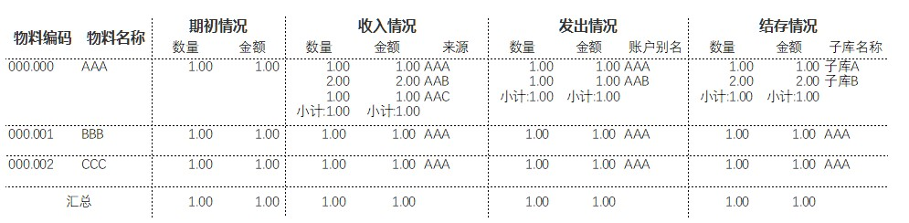
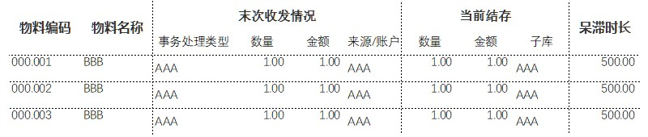

# 查询逻辑整理 #

## 收付存查询 ##

### 查询条件 ###

1. 期间（必要）（以下称为“本期”）
1. 查询统计类型（必要）（选择项：1.期初至今；2.本期年初至今）
1. 库存组织（必要）
1. 物料编码或名称（可选，模糊匹配）
1. 账户别名（可选，仅发出查询统计中模糊匹配）

### 查询与统计 ###

- 期初结存：物料编码，物料名称，按物料编码统计的上期（由条件2决定上期期间）期末结存
- 期末结存：物料编码，物料名称，按物料编码，子库编码，子库名称，按物料编码+子库编码分组汇总的本期期末结存
- 本期收入：物料编码，物料名称，来源情况，按物料编码+来源情况分组汇总的本期收入数量及收入金额
- 本期发出：物料编码，物料名称，账户别名，按物料编码+账户别名分组汇总的本期发出数量及发出金额

### 格式 ###

- 页标题：物料收付存统计查询
- 表头：用户输入的查询条件
- 表样：

## 呆滞库存分析 ##
（替代之前的账龄报表，因为无批次管理的账龄报表实际也不满足审计需求，审计的目的是对呆滞库存的分析，统计的逻辑是对库存大于零的物料的最近收发时间进行计算，得出最近收发时间距今的时间窗口分区，对于不同时间窗口分区的库存会有不同的管理手段）
### 查询条件 ###
1. 呆滞距今时间（必选，单选，五选一）（选择项：1.1-2年；2.2-3年；3.3-4年；4.4-5年；5.5年以上）

### 查询与统计 ###

- 最近一次事务处理：物料编码，物料名称，事务处理类型，数量，金额，来源情况或账户别名，事务处理时间
- 当前结存：物料编码，物料名称，子库编码，子库名称，按物料编码+子库编码分组汇总的当前结存
- 库存呆滞时长：当前时间 - 最近一次事务处理的时间（单位：天）

### 格式 ###
- 页标题：呆滞库存分析
- 表头：用户输入的查询条件
- 表样：

